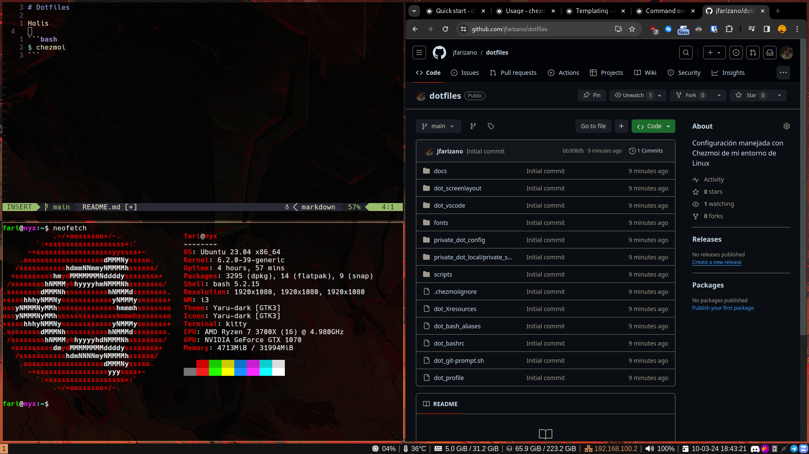
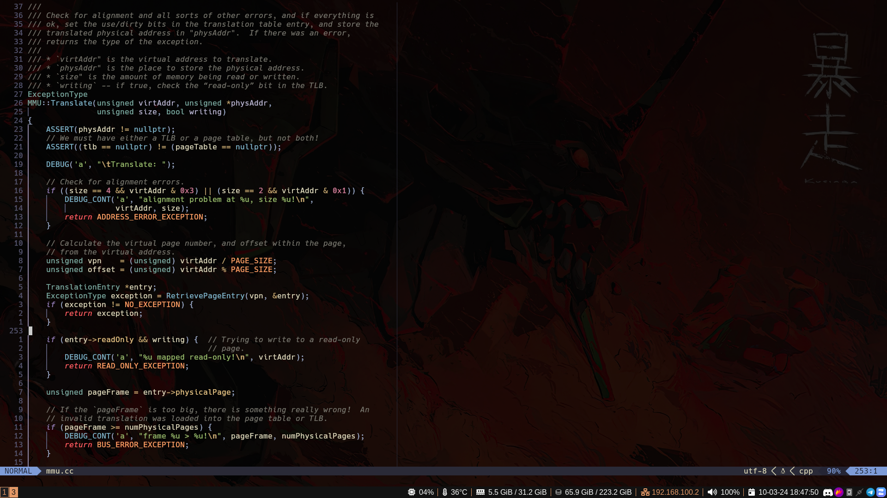

# Dotfiles

Repo con toda la configuración de mi entorno de Linux, corriendo sobre Ubuntu, utilizando i3 como windows manager, Kitty como terminal, Zoxide como reemplazo de cd y NeoVim (btw) como editor de texto.

Para sincronizar más fácilmente los cambios entre diferentes computadoras estoy probando Chezmoi, así que los archivos se van a ver raros. No recomiendo bajar y usar esta config ya que está armada para mí a mi gusto (aunque me olvido siempre los keybinds) pero se pueden robar cositas para ajustarlas a su gusto :)

## Capturas de pantalla
### Escritorio


### Ejemplo de cómo se vería NeoVim


## Instalación del entorno

### Instalar chezmoi:
```bash
sh -c "$(curl -fsLS get.chezmoi.io)" -- -b $HOME/.local/bin
```

### Descargar y aplicar configuración
Con autenticación (claves SSH)
```bash
chezmoi init --apply git@github.com:jfarizano/dotfiles.git
```
Sin autenticación:
```bash
chezmoi init --apply jfarizano
```
Ciertas configuraciones dependeran del hostname de la PC, por ej 'nyx' es mi PC de escritorio y 'helios' mi notebook, y no me enteresa ver la información de la batería en la de escritorio.
